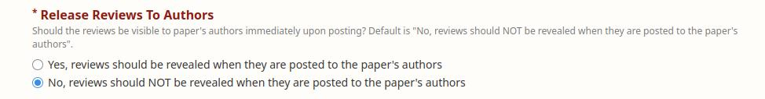
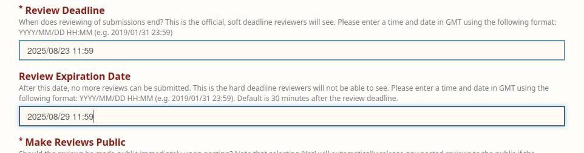
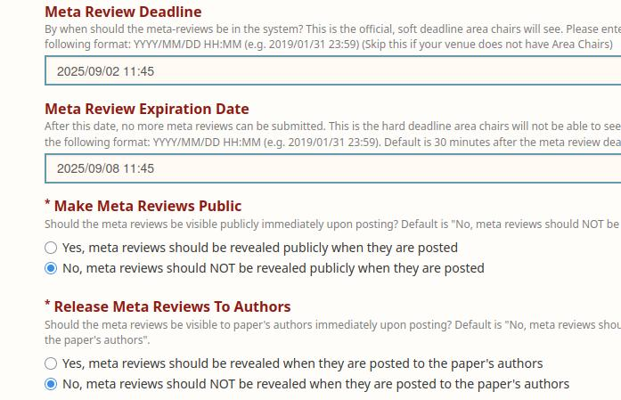
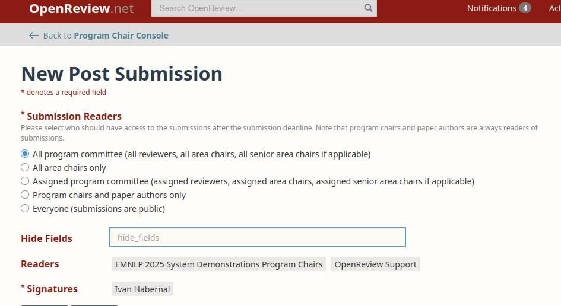
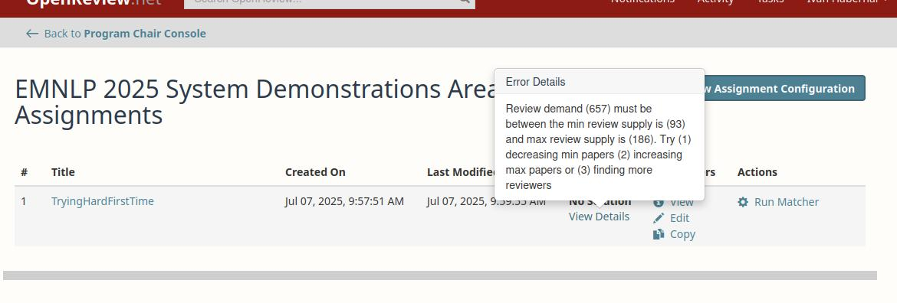
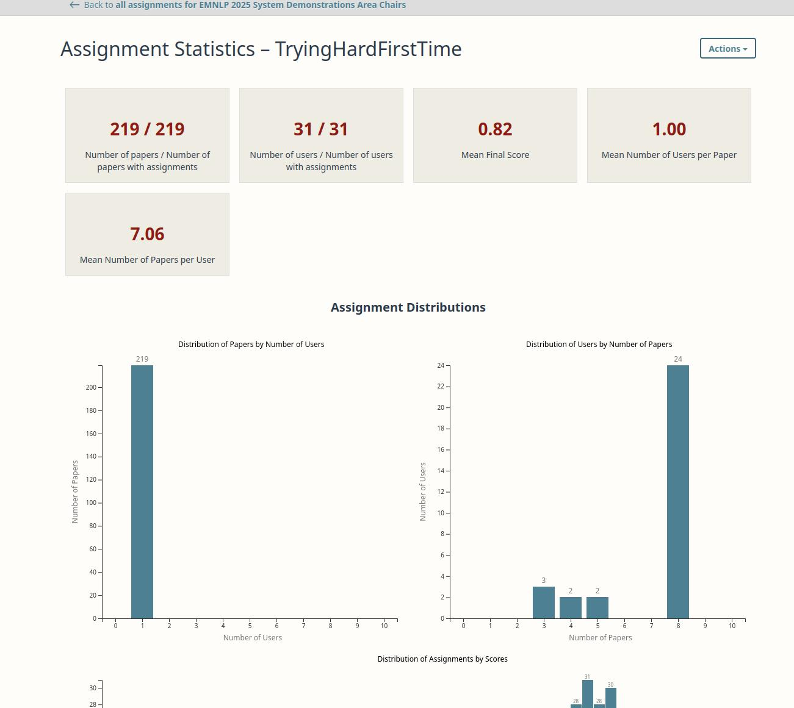
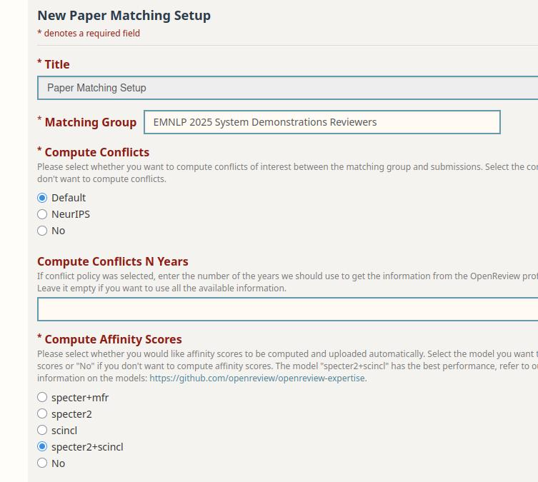

# OpenReview (OR) configuration for EMNLP 2025 demo papers

## Applying for OR venue

First, one has to apply for a new venue and fill out the form. I just filled the application form as good as I could, most of the configuration will be changed later anyway. Do this very soon. 

After getting the venue accepted, we can adjust the setup. Our OR main URL is https://openreview.net/group?id=EMNLP/2025/System_Demonstrations/

## Configuring OR

We inherited the OR configuration from EMNLP 2024 demo, available as a text-file in `emnlp24-config-export.txt`.

This file is basically a copy-pasted content from the browser from the OR "Full Venue Configuration" page. It was created partly by filling out some forms in OR and partly by inserting some JSON configuration to particular fields. We will have to do the same for EMNLP 2025. 

## Where to configure the venue

* Go to https://openreview.net/group?id=EMNLP/2025/System_Demonstrations/Program_Chairs
* Scroll down and click on "Full Venue Configuration"  https://openreview.net/forum?id=jjseaY5yN6&referrer=%5BProgram%20Chair%20Console%5D(%2Fgroup%3Fid%3DEMNLP%2F2025%2FSystem_Demonstrations%2FProgram_Chairs)
* This leads to the following page (see the screenshot below)


### Configuring the main features of the conference (aka. "Revision")

* Click on "Revision"
* Fill out this super long form accordingly (basically all the basic configuration of the venue)
  * I looked up most of the setup from EMNLP24 config in `emnlp24-config-export.txt` 
* The content of the `Additional Submission Options` field must be a valid JSON, so copy & paste the content of `additional-config-json-files/revision-additional-submission-options.json` file

After each configuration change, you will receive a confusing e-mail and a comment saying something like


When I got this first time, I panicked as I thought that **we now actually finished the process of reviewing and that I screwed up the entire conference**. Nope, I think this should simply read **Review Stage Configuration Updated** instead. See https://github.com/openreview/openreview-web/issues/2353 

You can check the final submission form by

1) going to the OR homepage


2) click on "EMNLP 2025 System Demonstrations"


3) click on "EMNLP 2025 System Demonstration Submission"


### Skipping "Bid Stage"

* We didn't do anything with bidding

### Configuring "Review Stage"

Similarly to the main "Revision" setup, we adjusted the "Review Stage" following the 2024 configuration. Note that all deadlines are GMT, so August 29 11:59 GMT should be August 28 Anywhere on Earth - at least I hope it will work like that :)

* Here's a screenshot for convenience


* for the field `Additional Review Form Options`, copy & paste the content of `additional-config-json-files/review-stage-additional-review-form-options.json`
* Note that EMNLP 2025 Demo track does not feature Best papers

#### Issue 1

* **Attention** The above configuration **is wrong** as it will make the reviews available directly after submitting, so long before the decision stage. I do not recommend this as we started receiving complaints about the reviews during the review stage already, plus it also confused many authors. So fix this by changing to "No, reviews should NOT be revealed when they are posted to the paper's authors"



#### Issue 2

* **Attention** We also mis-configured the "Review Expiration Date", which is the **hard deadline** for submitting. When left blank, reviews cannot be submitted right after "Review Deadline". So we had to re-adjust it to



### Configuring "Meta Review Stage"

* The same procedure applies for the Meta Review Stage


* JSON configuration for the `Additional Meta Review Form Options` field available in
`additional-config-json-files/meta-review-stage-additional-meta-review-form-options.json`

#### Issues

Seems like we need to re-adjust "Release Meta Reviews To Authors" and "Meta Review Expiration Date", as this will lead to similar problems as in the "Review Phase" above. So we set this up as follows:



### Configuring "Decision Stage"

For this stage, there is no additional JSON


* Bug (or a feature?)
  * There is no field to configure `Notify Authors: No, I will send the emails to the authors` (this was shown in the EMNLP 24 configuration, but not available in the Decision Stage form)
  * However, it appears in the full configuration automatically after submitting changes to "Decision Stage" form

### Skipping "Comment Stage"

* AFAIK, there's nothing to be configured as we don't use it

**TODO:** Actually yes, this is quite a nice feature to enable discussions between Program Chairs, ACs and, possible reviewers and authors, too. Need to set-this up properly, might be helpful for reporting triage for desk-rejects.

### Configuring "Submission Revision Stage" (which corresponds to Camera Ready configuration)


* We disabled changing (adding, removing) authors
* Nothing needed for `Submission Revision Additional Options`, AFAIK

### Configuring "Post Submission" stage

Here I have no idea, when this stage is activated, so I left the default option



### Skipping "Reviewer Registration" and "Area Chair Registration"

We invited reviewers + ACs directly (under "Full Venue Configuration", scroll down below the configuration listing, on the right hand side there are three buttons, one reads "Recruitment") so this configuration seems to serve no purpose.

### Skipping "Ethics Review Stage"

Looks like EMNLP 24 also didn't configure this stage

## How to run the show - paper assignments, etc.

Items present in EMNLP 24 configuration which we are still missing:
* TODO

After all the configurations above (minus the missing items), the program chair console shows the following timeline:


This gives me hope that we will be able to assign ACs to papers after the submission, so each AC can do desk rejects of their own batch.

However, after clicking on "Area Chairs Paper Assignment", we got:

> Error 404
> 
> The server responded with the following message:
>
> There is currently no assignment configuration ready for use. Please go to your venue request form and use the Paper Matching Setup to compute conflicts and/or affinity scores.

That's not a bug! According to the OR guidelines, **paper matching becomes available after the submission deadline**! See https://docs.openreview.net/how-to-guides/paper-matching-and-assignment/how-to-do-automatic-assignments/how-to-setup-paper-matching-by-calculating-affinity-scores-and-conflicts

### Enable Paper Matching (after submission deadline has passed)

* Go to "Full Venue Configuration"
* Scroll down, "Paper Matching Setup" should appear there


* Click on "Paper Matching Setup" and fill out the form (I tried the following)


**You have to wait at least 10 minutes after "Paper Matching Setup"** so that some scores are computed somewhere!!! After that, you will receive the usual e-mail notification (with some further info).

Now you can click on "Area Chair Paper Assignment". Loading the next page takes a while (like a loong time...)


This is the starting point


Let's do "New Assignment Configuration", which opens this horrifying pop-up


Some fields are clearly explained (but somewhere else, not in this popup, see https://docs.openreview.net/how-to-guides/paper-matching-and-assignment/how-to-do-automatic-assignments/how-to-run-a-paper-matching), but some are hard to decipher

* What is "Alternates"?
* I opened this: https://github.com/openreview/openreview-web/issues/2355

So I tried this and left the rest as default (btw: solver: MinMax which is the default fallback)


which gives us this new configuration listed


The documentation says 

> You can view, edit or copy the values you filled out in the matching form. When you are happy with your configuration, you should hit 'Run Matcher' and wait until its status is 'Complete'.

I don't know if I'm happy because I have no clue, so let's run "Run Matcher". After some while, the overview shows "No Solution":



OK, I think I messed up something - obviously we need just one AC per paper, so maybe "User Demand" should be just 1 instead of 3? This did the trick!


So let's explore "View Statistics"



Maybe we should look at the details to take care of smaller loads etc.

Here the **manual** re-configuration is necessary - on can click on the bars to select papers or users with a certain number of assignments and then un-assign or assign other persons (this is done through the standard "Edge Browser" in OR, similar to reviewer assignment in area chairing). This takes time and care to cater for ACs max load, etc.

After some manual work, each paper has one AC, all max load requests (btw we didn't put them into OR, I didn't know how to do that easily, so I checked with our list of ACs) and max load of 8 papers.


It's time to deploy the assignment (https://docs.openreview.net/how-to-guides/paper-matching-and-assignment/how-to-do-automatic-assignments/how-to-deploy-the-proposed-assignments)

> Be careful before deploying proposed assignments!

Yeah, whatever... How can I be careful? So I very carefully clicked on "Deploy Assignment". That should work. It said "Deployment started." and that's it?! After refreshing, there is this new option, though...


Looks like it worked! Now under "Area Chair Status" we can see the assignments!


## How to do desk rejects

We asked ACs (through mass mail) to check papers and report via e-mail. Actually, they can easily write to each paper an "Official Comment" which will be readable by AC and program chairs only, we get the e-mail notifications, and can decide on the paper later. So it's much better than e-mails.

## Assigning reviewers

I think we need to adjust the "Review Stage" to start on July 14, not on July 7 (because on July 7 we're still in the triage/desk reject mode)

So after adjustment:

```plain
Timeline:
Submissions from 17 May 2025, 4:17 pm CEST until 05 Jul 2025, 1:59 pm CEST and expires 05 Jul 2025, 2:29 pm CEST
Reviewers Recruitment from 17 May 2025, 4:20 pm CEST no deadline and expired
Reviewing from 14 Jul 2025, 1:59 pm CEST until 23 Aug 2025, 1:59 pm CEST and expires 23 Aug 2025, 2:29 pm CEST
Commenting from 07 Jul 2025, 11:43 am CEST no deadline and expired
Meta Reviews from 23 Aug 2025, 3:59 pm CEST until 02 Sept 2025, 1:45 pm CEST and expires 02 Sept 2025, 2:15 pm CEST
Decisions from 01 Sept 2025, 1:59 pm CEST until 05 Sept 2025, 1:59 pm CEST and expires 15 Sept 2025, 1:59 pm CEST
Area Chairs Paper Assignment open until Reviewing starts
Reviewers Paper Assignment open until Reviewing starts
```

### Configure paper matching for reviewers

I believe this will be the same process as for configuring paper matching for ACs

* Go to "Full Venue Configuration"
* Scroll down to show the "Paper Matching Setup" button, click
* Choose "Reviewers" from the list


* And **wait at least 10 minutes** before receiving an e-mail confirmation that the matching is ready

And here's the result:

> Comment:
8 Reviewers without a profile.
> 
> Affinity scores and/or conflicts could not be computed for the users listed under 'Without Profile'. You will not be able to run the matcher until all Reviewers have profiles. You have two options:
> 
> You can ask these users to sign up in OpenReview and upload their papers. After all Reviewers have done this, you will need to rerun the paper matching setup to recompute conflicts and/or affinity scores for all users.
You can remove these users from the Reviewers group: https://openreview.net/group/edit?id=EMNLP/2025/System_Demonstrations/Reviewers. You can find all users without a profile by searching for the '@' character in the search box.
> 
> 15 Reviewers listed under 'Without Publication' don't have any publications.

So we need to write everyone to fill-out their profile....

* So I messaged them individually (annoying, there's no easy mass-mailer?) to ask them to sign up to OR
* I mass-mailed all reviewers to update their publications

* ... after two days or so, I'm going to re-run it again (basically, repeat the last step to configure a new Paper Matching Setup, wait for 10 mins etc.)

Without Profile: 6 reviewers, I e-mailed them


## Playground for testing OR

(Eventually I didn't play around that much for lack of time, but for a bigger conference, I'd do so to get really familiar with the entire workflow well in advance)

* Following OR recommendation here: https://docs.openreview.net/how-to-guides/workflow/how-to-test-your-venue-workflow
* Created a new account on https://dev.openreview.net
* Created EMNLP25 Demo Test venue and e-mailed OR to deploy, so we can test with multiple other accounts how the submission works, etc.

